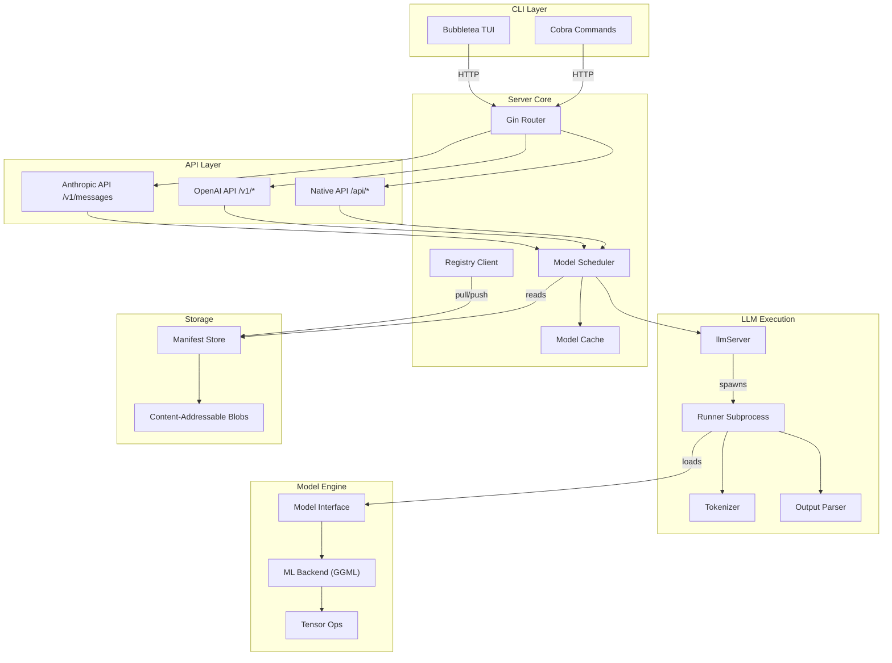
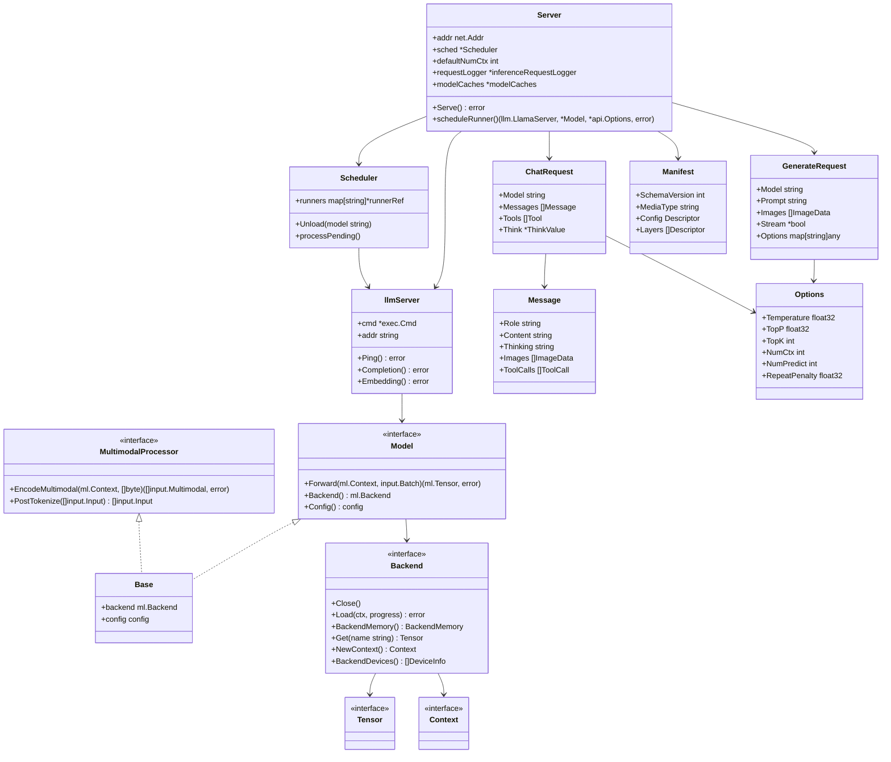
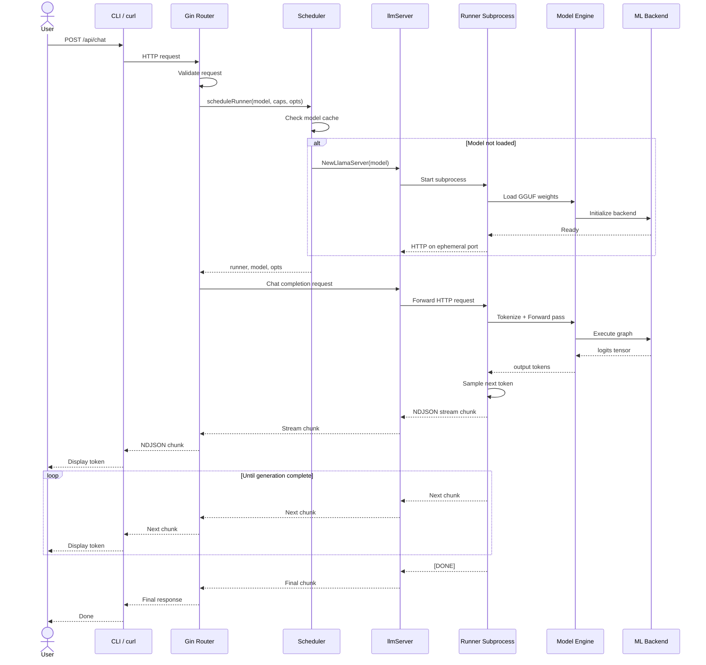
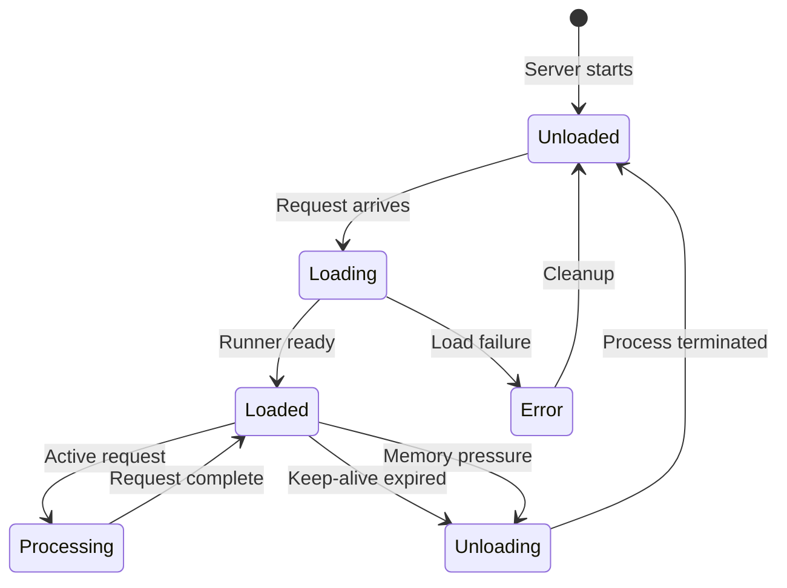

# Ollama

Get up and running with large language models locally. Ollama provides a simple CLI and a REST API for running, managing, and chatting with LLMs and multimodal models on your own hardware.

## Table of Contents
- [Features](#features)
- [Architecture](#architecture)
- [Installation](#installation)
- [Usage](#usage)
- [API Reference](#api-reference)
- [CLI Reference](#cli-reference)
- [Configuration](#configuration)
- [Development](#development)
- [Testing](#testing)
- [UML Diagrams](#uml-diagrams)
- [Contributing](#contributing)
- [License](#license)

## Features

- **Local LLM Inference** -- Run large language models entirely on your own hardware with GPU acceleration
- **Multimodal Support** -- Chat with vision models that understand images, and generate images with diffusion models
- **OpenAI-Compatible API** -- Drop-in replacement for `/v1/chat/completions`, `/v1/completions`, `/v1/embeddings`, and more
- **Anthropic-Compatible API** -- Supports `/v1/messages` for Claude-style integrations
- **Model Management** -- Pull, push, create, copy, and delete models via CLI or API
- **Streaming-First Design** -- NDJSON streaming for real-time token generation
- **Tool Calling** -- Models can invoke tools with structured JSON output
- **Thinking / Reasoning** -- Support for reasoning models with configurable depth
- **Multiple Backends** -- CUDA, ROCm, Metal (macOS), Vulkan, and MLX acceleration
- **Subprocess Isolation** -- Runner processes are isolated from the server for stability

## Architecture

Ollama is written primarily in Go with C/C++ backends for model inference. The architecture separates concerns into distinct layers:

- **CLI (`cmd/`)** -- Cobra-based commands that communicate with the server over HTTP
- **HTTP Server (`server/`)** -- Gin-based web server exposing native, OpenAI, and Anthropic APIs
- **Scheduler (`server/sched.go`)** -- Manages GPU memory, model loading/unloading, and request queuing
- **LLM Runner (`llm/`)** -- Spawns subprocess runners (`ollama runner`) that expose a local HTTP API
- **Model Abstraction (`model/`)** -- Plugin-based model architectures with GGUF tensor auto-loading
- **ML Backend (`ml/`)** -- Abstracted tensor operations via the GGML backend
- **Manifest Storage (`manifest/`)** -- Docker-inspired content-addressable blob storage

## Installation

### Prerequisites

- Go 1.26+
- C/C++ compiler (Clang on macOS, GCC/Clang on Linux, MSVC or TDM-GCC on Windows)
- CMake 3.25+
- Optional: CUDA SDK, ROCm, Vulkan SDK, or Metal toolchain (macOS Apple Silicon)

### Build from Source

```bash
# Clone the repository
git clone https://github.com/ollama/ollama.git
cd ollama

# Build native backends
cmake -B build
cmake --build build

# Run the server
go run . serve
```

### Docker

```bash
docker build .

# Build with ROCm support
docker build --build-arg FLAVOR=rocm .
```

### Pre-built Binaries

Download pre-built binaries for macOS, Linux, and Windows from [ollama.com/download](https://ollama.com/download).

## Usage

### Start the Server

```bash
ollama serve
```

The server listens on `127.0.0.1:11434` by default.

### Run a Model

```bash
ollama run llama3.2
```

### Pull a Model

```bash
ollama pull llama3.2
```

### List Local Models

```bash
ollama list
```

### Generate Text (API)

```bash
curl http://localhost:11434/api/generate -d '{
  "model": "llama3.2",
  "prompt": "Why is the sky blue?"
}'
```

### Chat (API)

```bash
curl http://localhost:11434/api/chat -d '{
  "model": "llama3.2",
  "messages": [
    {"role": "user", "content": "Why is the sky blue?"}
  ]
}'
```

## API Reference

### Native Ollama API (`/api/*`)

| Method | Endpoint | Description |
|--------|----------|-------------|
| POST | `/api/generate` | Text generation |
| POST | `/api/chat` | Chat completion |
| POST | `/api/embed` | Batch embeddings |
| POST | `/api/embeddings` | Single embedding |
| POST | `/api/pull` | Download a model |
| POST | `/api/push` | Upload a model |
| POST | `/api/create` | Create a model from a Modelfile |
| POST | `/api/copy` | Copy a model |
| DELETE | `/api/delete` | Delete a model |
| POST | `/api/show` | Show model details |
| GET | `/api/tags` | List local models |
| GET | `/api/ps` | List running models |

### OpenAI-Compatible API (`/v1/*`)

| Method | Endpoint | Description |
|--------|----------|-------------|
| POST | `/v1/chat/completions` | Chat completions |
| POST | `/v1/completions` | Text completions |
| POST | `/v1/embeddings` | Embeddings |
| GET | `/v1/models` | List models |
| POST | `/v1/images/generations` | Image generation |
| POST | `/v1/audio/transcriptions` | Audio transcription |

### Anthropic-Compatible API

| Method | Endpoint | Description |
|--------|----------|-------------|
| POST | `/v1/messages` | Messages API |

### Key Request Types

- `GenerateRequest` -- Text generation with prompt, images, options, and format controls
- `ChatRequest` -- Multi-turn chat with messages, tools, and thinking options
- `EmbedRequest` -- Batch text embedding with truncation and dimension controls
- `Options` -- Model hyperparameters (temperature, top_p, num_ctx, etc.)

## CLI Reference

| Command | Description |
|---------|-------------|
| `ollama` | Interactive TUI launcher |
| `ollama serve` | Start the HTTP API server |
| `ollama run MODEL [PROMPT]` | Chat or generate with a model |
| `ollama create MODEL` | Create a model from a Modelfile |
| `ollama pull MODEL` | Download a model from the registry |
| `ollama push MODEL` | Upload a model to the registry |
| `ollama list` | List locally available models |
| `ollama ps` | List currently loaded models |
| `ollama show MODEL` | Display model details |
| `ollama stop MODEL` | Unload a model from memory |
| `ollama cp SRC DST` | Copy a model |
| `ollama rm MODEL...` | Delete local models |
| `ollama signin` | Sign in to ollama.com |
| `ollama signout` | Sign out from ollama.com |
| `ollama launch` | Launch third-party integrations |

## Configuration

Ollama is configured through environment variables:

| Variable | Default | Description |
|----------|---------|-------------|
| `OLLAMA_HOST` | `127.0.0.1:11434` | Bind address for the server |
| `OLLAMA_MODELS` | `~/.ollama/models` | Model storage path |
| `OLLAMA_NUM_PARALLEL` | `1` | Number of parallel request slots |
| `OLLAMA_MAX_LOADED_MODELS` | `1` | Maximum concurrently loaded models |
| `OLLAMA_FLASH_ATTENTION` | `false` | Enable flash attention |
| `OLLAMA_KV_CACHE_TYPE` | -- | KV cache quantization type |
| `OLLAMA_GPU_OVERHEAD` | -- | VRAM overhead reservation |
| `OLLAMA_DEBUG` | `false` | Enable debug logging |
| `OLLAMA_EXPERIMENT` | -- | Comma-separated list of experiments |

## Development

### Project Structure

```
ollama/
  api/          -- API request/response types and Go HTTP client
  cmd/          -- CLI commands (Cobra + Bubbletea TUI)
  server/       -- HTTP server, scheduler, and route handlers
  llm/          -- LLM runner subprocess management
  model/        -- Model architecture implementations and interfaces
  ml/           -- ML backend abstraction (GGML)
  manifest/     -- Model manifest and blob storage
  tokenizer/    -- Text tokenization
  template/     -- Prompt template rendering
  parser/       -- Output parsers (thinking blocks, tool calls)
  kvcache/      -- Key-value cache management
  runner/       -- Runner dispatch (llama, ollama, imagegen, mlx)
  auth/         -- Authentication utilities
  discover/     -- Hardware capability detection
  fs/           -- Filesystem and GGUF parsing
  convert/      -- Model format conversion tools
  integration/  -- Integration tests
  x/            -- Experimental features
```

### Common Tasks

```bash
# Run the server
go run . serve

# Run tests
go test ./...

# Build native backends
cmake -B build && cmake --build build

# Run the linter
golangci-lint run
```

## Testing

```bash
# Run all tests
go test ./...

# Run integration tests (requires built backends)
go test ./integration/...

# Run with verbose output
go test -v ./...

# Run a specific package
go test ./server/...
```

## UML Diagrams

### Component Architecture



### Class Diagram -- Core Types



### Sequence Diagram -- Chat Request Flow



### State Diagram -- Model Lifecycle



## Contributing

See [CONTRIBUTING.md](./CONTRIBUTING.md) for detailed guidelines.

- Open an issue to discuss non-trivial changes before submitting a PR
- Write commit messages in the format: `package: short description`
- Include tests that validate behavior, not implementation
- Keep dependencies to a minimum
- Reach out on [Discord](https://discord.gg/ollama) if you need help

## License

MIT License. See [LICENSE](./LICENSE) for details.
